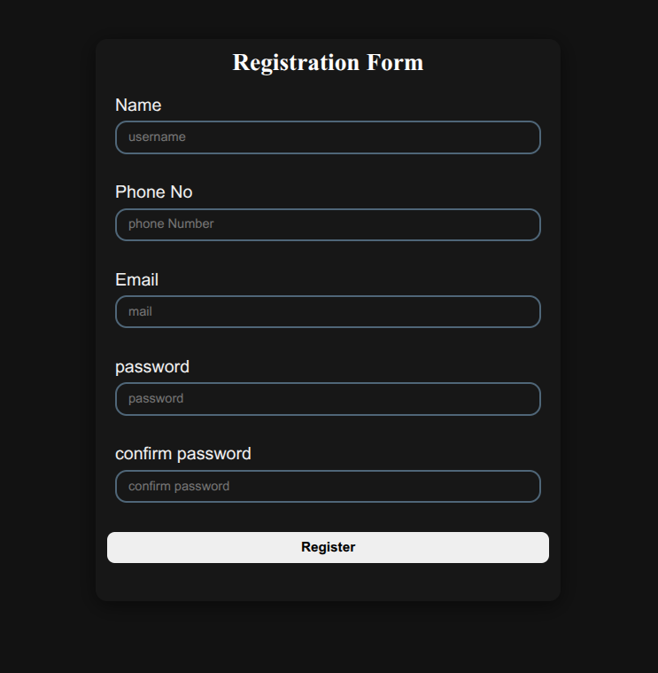

# 🚀 Registration Form with JavaScript Validation

This is a simple **Registration Form** built using **HTML**, **CSS**, and **Vanilla JavaScript** that performs **client-side validation** using Regular Expressions. It ensures users enter valid data before form submission.

---

## 📋 Features

✅ Real-time form validation  
✅ Error messages for each invalid field  
✅ Regular expression-based validation for:
- Username (alphabets and spaces, 3-20 characters)
- Email
- Phone number (starts with 6/7/8/9, 10 digits)
- Password strength (min 8 chars, upper, lower, digit, special char)
- Confirm password matching  
✅ Clears fields and shows success alert on successful registration  
✅ All done using **pure JavaScript**, no libraries or frameworks

---
## 🛠️ Technologies Used

- HTML5  
- CSS3 (Optional for styling)  
- JavaScript (ES6+)

---

## 🧪 Example Regex Used

- **Username:** `/^[A-Za-z ]{3,20}$/`
- **Email:** `/^[A-Za-z0-9]+(?:[.%_+][A-Za-z0-9]+)*@[A-Za-z0-9]+\.[A-Za-z]{2,}$/`
- **Phone:** `/^[6-9][\d]{9}$/`
- **Password:** `/^(?=.*[A-Z])(?=.*[a-z])(?=.*[\d])(?=.*[\W_]).{8,}$/`

---

## 🖼️ Preview

---
## 🔗 Live Demo

👉 [View Live Demo]()

---

## 🧾 License

This project is open source and free to use for educational purposes.

---

